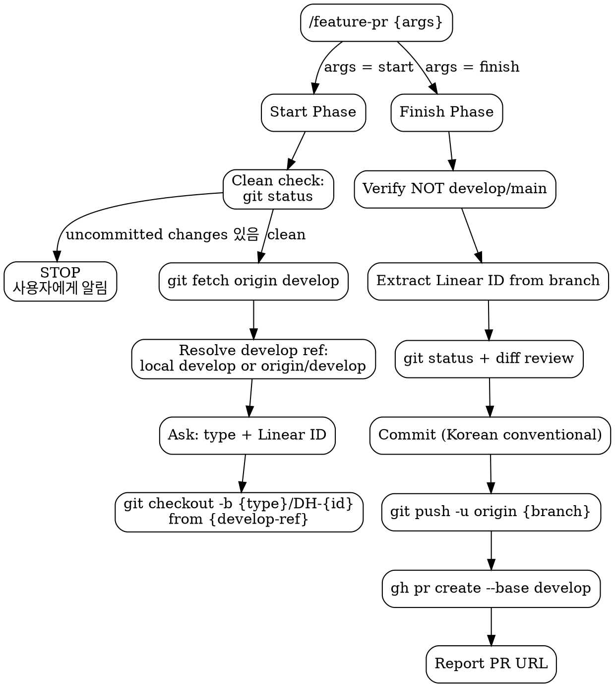

# Feature PR Lifecycle

Two-phase skill for feature branch workflow: **start** (branch creation) and **finish** (PR creation).

## Flowchart



## Start Phase (`/feature-pr start`)

1. **Clean check**: `git status`로 워킹 트리 상태 확인
   - uncommitted changes가 있으면 → **STOP**, 사용자에게 변경사항 목록을 알리고 처리 방법 확인
   - clean 상태면 → 다음 단계 진행
2. **Fetch latest**: `git fetch origin develop`
3. **Resolve develop ref**:
   - 현재 `develop` 브랜치에 있으면: `git pull origin develop` 후 로컬 `develop` 사용
   - `develop`이 다른 워크트리에 체크아웃되어 있으면: `origin/develop`을 base로 사용
4. **Ask user** (multiple choice):
   - Branch type: `feat` | `fix` | `refactor`
   - Linear ID (숫자만, e.g. `6`)
5. **Create & switch**: `git checkout -b {type}/DH-{id} {develop-ref}`
   - `{develop-ref}`: 로컬 `develop` 또는 `origin/develop`
6. **Confirm**: report branch name, ready to work

> **실행 시점**: 설계/계획 문서 작성 등 파일을 생성하기 **전에** 실행한다. 브랜치가 먼저 생성되어야 모든 작업 산출물이 해당 브랜치에 포함된다.

## Finish Phase (`/feature-pr finish`)

1. **Guard**: current branch must NOT be `develop` or `main`. Abort if so.
2. **Extract Linear ID** from branch name (e.g. `feat/DH-6` -> `DH-6`)
3. **Review changes**: `git status`, `git diff`
4. **Commit** in logical units using Korean conventional commits (e.g. `feat: 스케줄 정렬 기능 구현`). Co-Authored-By 헤더를 포함하지 않는다.
5. **Push**: `git push -u origin {branch-name}`
6. **Ensure label exists** — check and create if missing:

```bash
# Label mapping: feat -> 🚀 FEAT, fix -> 🩺 FIX, refactor -> 🔋 REFACTOR
gh label list --search "{label}" --json name -q '.[].name' | grep -q "{label}" \
  || gh label create "{label}"
```

7. **Create PR** to develop (intended for squash merge):

```bash
gh pr create --base develop \
  --title "[{TYPE}] {한글 설명}" \
  --body "$(cat <<'EOF'
{PR template - see below}
EOF
)" \
  --label "{label}" \
  --assignee @me
```

| Field | Value |
|-------|-------|
| Title | `[{TYPE}] {한글 설명}` (e.g. `[FEAT] 스케줄 정렬 기능 구현`) |
| Label | `feat` -> `🚀 FEAT`, `fix` -> `🩺 FIX`, `refactor` -> `🔋 REFACTOR` |
| Assignee | `@me` (current user) |
| Body | PR template below |

8. **Report** PR URL to user

### PR Template

```markdown
## Issue Number
[DH-{id}](https://linear.app/dh-crew/issue/DH-{id})

## As-Is
### 1. 기존 동작 및 문제 상황
- {기존에 어떤 동작/상태였는지}
- {어떤 문제가 발생했는지}

### 2. 대안 분석 (각 접근 방식의 장단점)
- {방식 A}: {장점} / {단점}
- {방식 B}: {장점} / {단점}

## To-Be
### 1. 최종 구현 결과
- {구현된 핵심 내용}

### 2. 기존 대비 변경 내역
- {변경 전} → {변경 후}

### 3. 미해결 이슈 및 향후 검토 사항
- {남은 이슈 또는 추가 검토 필요 사항}

## ✅ Check List
- [x] Have all tests passed?
- [x] Have all commits been pushed?
- [x] Did you verify the target branch for the merge?
- [x] Did you assign the appropriate assignee(s)?
- [x] Did you set the correct label(s)?

## 📸 Test Screenshot

## Additional Description
```

## Red Flags

- **Never** target any branch other than `develop`
- **Never** run finish phase on `develop` or `main`
- **Never** skip clean check — uncommitted changes must be handled before branch creation
