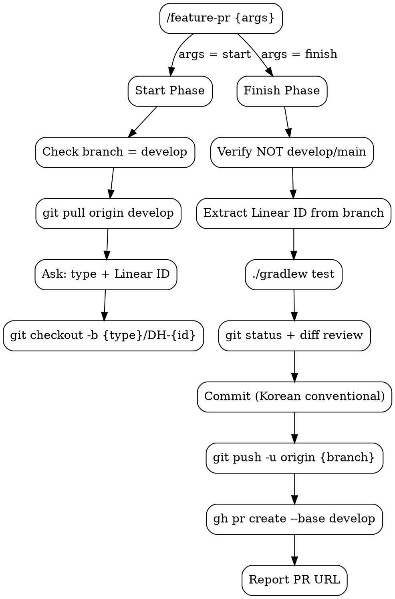

# Feature PR Lifecycle

Two-phase skill for feature branch workflow: **start** (branch creation) and **finish** (PR creation).

## Flowchart



## Start Phase (`/feature-pr start`)

1. **Check branch** -- if not on `develop`, ask user to switch
2. **Pull latest**: `git pull origin develop`
3. **Ask user** (multiple choice):
   - Branch type: `feat` | `fix` | `refactor`
   - Linear ID (e.g. `DH-6`)
4. **Create & switch**: `git checkout -b {type}/DH-{id}`
5. **Confirm**: report branch name, ready to work

## Finish Phase (`/feature-pr finish`)

1. **Guard**: current branch must NOT be `develop` or `main`. Abort if so.
2. **Extract Linear ID** from branch name (e.g. `feat/DH-6` -> `DH-6`)
3. **Run tests**: `./gradlew test` -- if tests fail, report and **STOP**
4. **Review changes**: `git status`, `git diff`
5. **Commit** in logical units using Korean conventional commits (e.g. `feat: 스케줄 정렬 기능 구현`)
6. **Push**: `git push -u origin {branch-name}`
7. **Ensure label exists** — check and create if missing:

```bash
# Label mapping: feat -> 🚀 FEAT, fix -> 🚨 FIX, refactor -> 🔋 REFACTOR
gh label list --search "{label}" --json name -q '.[].name' | grep -q "{label}" \
  || gh label create "{label}"
```

8. **Create PR** to develop (intended for squash merge):

```bash
gh pr create --base develop \
  --title "[{TYPE}] {한글 설명}" \
  --body "$(cat <<'EOF'
{PR template - see below}
EOF
)" \
  --label "{label}" \
  --assignee @me
```

| Field | Value |
|-------|-------|
| Title | `[{TYPE}] {한글 설명}` (e.g. `[FEAT] 스케줄 정렬 기능 구현`) |
| Label | `feat` -> `🚀 FEAT`, `fix` -> `🩺 FIX`, `refactor` -> `🔋 REFACTOR` |
| Assignee | `@me` (current user) |
| Body | PR template below |

9. **Report** PR URL to user

### PR Template

```markdown
## Issue Number
DH-{id}

## As-Is
### 1. 기존 동작 및 문제 상황
- {기존에 어떤 동작/상태였는지}
- {어떤 문제가 발생했는지}

### 2. 대안 분석 (각 접근 방식의 장단점)
- {방식 A}: {장점} / {단점}
- {방식 B}: {장점} / {단점}

## To-Be
### 1. 최종 구현 결과
- {구현된 핵심 내용}

### 2. 기존 대비 변경 내역
- {변경 전} → {변경 후}

### 3. 미해결 이슈 및 향후 검토 사항
- {남은 이슈 또는 추가 검토 필요 사항}

## ✅ Check List
- [x] Have all tests passed?
- [x] Have all commits been pushed?
- [x] Did you verify the target branch for the merge?
- [ ] Did you assign the appropriate assignee(s)?
- [ ] Did you set the correct label(s)?

## 📸 Test Screenshot

## Additional Description
```

## Red Flags

- **Never** create PR with failing tests
- **Never** target any branch other than `develop`
- **Never** run finish phase on `develop` or `main`
