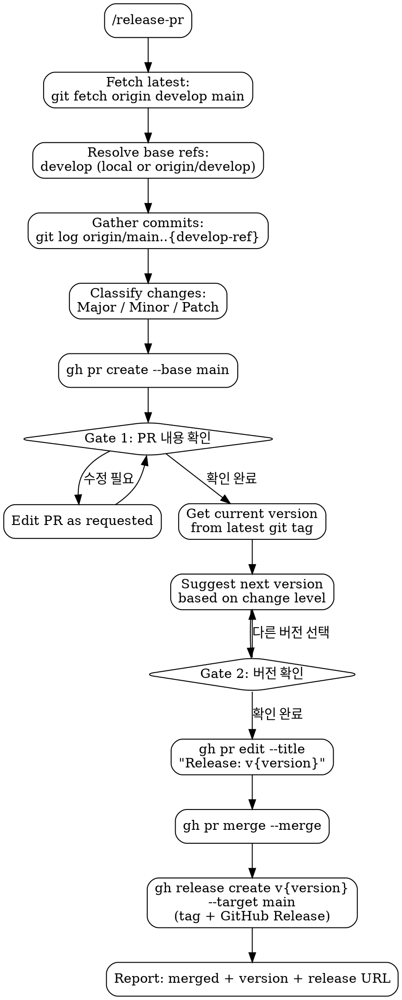

# Release PR

Standalone skill for creating release PRs from `develop` to `main`. Includes two confirmation gates, automatic version suggestion, and GitHub Release creation.

## Flowchart



## Process

1. **Fetch latest**: `git fetch origin develop main`
   - Worktree 환경에서 `develop`이 다른 워크트리에 체크아웃되어 있을 수 있으므로, 직접 checkout 하지 않고 remote refs 기반으로 작업
   - `develop`에 있으면 해당 브랜치 사용, 아니면 `origin/develop` 사용

2. **Gather commits**: `git log origin/main..{develop-ref} --format='%h %s (%an)'`
   - `{develop-ref}`: 로컬 `develop` 또는 `origin/develop`
   - Classify each commit:
     - **Major**: breaking/incompatible API changes
     - **Minor**: `feat:` commits, new functionality
     - **Patch**: `fix:`, `test:`, `docs:`, `refactor:`, `chore:`
   - Resolve each author to their GitHub username (check commit history or `gh api`)

3. **Create PR**:

```bash
gh pr create --base main --head develop \
  --title "Release: (version TBD)" \
  --body "$(cat <<'EOF'
## Summary

### Major Changes
- {한글 설명} @{author-github-id}

### Minor Changes
- {한글 설명} @{author-github-id}

### Patch Changes
- {한글 설명} @{author-github-id}
EOF
)" \
  --assignee @me
```

   - Omit empty sections (no Major commits -> no Major heading)
   - Each item: `- {한글 설명} @{author-github-id}`

4. **Gate 1 — PR Confirmation**: Ask "PR 내용 확인해주세요. 문제 없나요?"
   - No -> edit PR content as requested, re-confirm
   - Yes -> proceed

5. **Gate 2 — Version Confirmation**:
   - Current version: `git describe --tags --abbrev=0` (default `0.0.0` if no tags exist)
   - Suggest next version based on highest change level:

| Highest Level | Bump | Example |
|---------------|------|---------|
| Major | major | 1.0.1 -> 2.0.0 |
| Minor | minor | 1.0.1 -> 1.1.0 |
| Patch | patch | 1.0.1 -> 1.0.2 |

   - Present as multiple choice for user to confirm or override
   - User picks different version -> use that

6. **Execute release**:
   - `gh pr edit {pr-number} --title "Release: v{version}"`
   - `gh pr merge {pr-number} --merge --delete-branch=false`
   - Create GitHub Release (tag + release notes in one step):

```bash
gh release create "v{version}" \
  --target main \
  --title "v{version}" \
  --notes "$(cat <<'EOF'
{PR body 내용 그대로}
EOF
)"
```

   - `gh release create`가 태그 생성과 GitHub Release 생성을 동시에 처리
   - Release title: `v{version}`
   - Release notes: PR body의 Summary 섹션 내용
   - Report: done, merged, version, release URL

## Red Flags

- **Never** merge without both confirmations (PR content + version)
- **Never** skip version confirmation
- **Never** create release PR from any branch other than `develop`
- **Never** create tag separately — always use `gh release create` to ensure tag + release are atomic
- **Never** delete `develop` branch — merge 시 반드시 `--delete-branch=false` 사용
