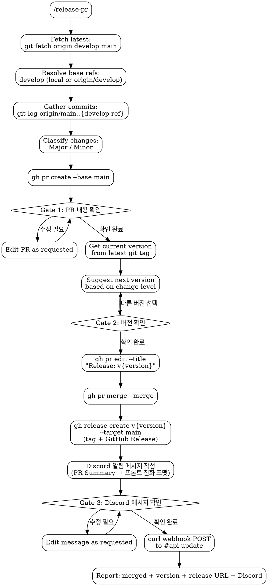

# Release PR

Standalone skill for creating release PRs from `develop` to `main`. Includes three confirmation gates (PR content, version, Discord message), automatic version suggestion, GitHub Release creation, and Discord `#api-update` channel notification.

## Flowchart



## Process

1. **Fetch latest**: `git fetch origin develop main`
   - Worktree 환경에서 `develop`이 다른 워크트리에 체크아웃되어 있을 수 있으므로, 직접 checkout 하지 않고 remote refs 기반으로 작업
   - `develop`에 있으면 해당 브랜치 사용, 아니면 `origin/develop` 사용

2. **Gather commits**: `git log origin/main..{develop-ref} --format='%h %s (%an)'`
   - `{develop-ref}`: 로컬 `develop` 또는 `origin/develop`
   - Classify each commit:
     - **Major**: `feat:` 새 기능 추가, API 스펙 변경, breaking changes
     - **Minor**: `fix:`, `docs:`, `test:`, `refactor:`, `chore:` 등 버그 수정 및 내부 개선
   - Resolve each author to their GitHub username (check commit history or `gh api`)

3. **Create PR**:

```bash
gh pr create --base main --head develop \
  --title "Release: (version TBD)" \
  --body "$(cat <<'EOF'
## Summary

### Major Changes
- {한글 설명} (#PR번호) @{author-github-id}

### Minor Changes
- {한글 설명} (#PR번호) @{author-github-id}
EOF
)" \
  --assignee @me
```

   - Omit empty sections (no Major commits -> no Major heading)
   - Each item: `- {한글 설명} (#PR번호) @{author-github-id}`
   - PR 번호는 squash merge 커밋 메시지에서 추출 (e.g. `(#78)` → `#78`)

4. **Gate 1 — PR Confirmation**: Ask "PR 내용 확인해주세요. 문제 없나요?"
   - No -> edit PR content as requested, re-confirm
   - Yes -> proceed

5. **Gate 2 — Version Confirmation**:
   - Current version: `git describe --tags --abbrev=0` (default `0.0.0` if no tags exist)
   - Suggest next version based on highest change level:

| Highest Level | Bump | Example |
|---------------|------|---------|
| Major | minor | 1.0.1 -> 1.1.0 |
| Minor | patch | 1.0.1 -> 1.0.2 |

   - Present as multiple choice for user to confirm or override
   - User picks different version -> use that

6. **Execute release**:
   - `gh pr edit {pr-number} --title "Release: v{version}"`
   - `gh pr merge {pr-number} --merge --delete-branch=false`
   - Create GitHub Release (tag + release notes in one step):

```bash
gh release create "v{version}" \
  --target main \
  --title "v{version}" \
  --notes "$(cat <<'EOF'
{PR body 내용 그대로}
EOF
)"
```

   - `gh release create`가 태그 생성과 GitHub Release 생성을 동시에 처리
   - Release title: `v{version}`
   - Release notes: PR body의 Summary 섹션 내용

7. **Discord 알림** — `#api-update` 채널에 변경사항 전송:
   - `~/.claude/env` 파일에서 `DH_API_UPDATE_DISCORD_WEBHOOK_URL` 로드
   - 파일이 없거나 변수가 없으면 → 안내 메시지 출력 후 skip (릴리스 자체는 정상 완료)
   - PR Summary를 프론트엔드 팀원이 이해하기 쉬운 포맷으로 변환
   - **Discord Markdown 포맷 규칙**:
     - 들여쓰기 기반 포맷 사용 금지 (Discord에서 무시됨)
     - `**볼드**`와 백틱 `` ` `` 코드블록 위주로 구성
     - 볼드는 번호에만 적용 (`**1.**`), 제목 전체를 감싸지 않음 (줄 간격 벌어짐 방지)
     - 섹션 구분에는 이모지 접두어 사용 (📌, ✅ 등)
     - 같은 맥락 내 줄(번호-리스트)은 빈 줄 없이 붙임
     - 맥락이 바뀌는 경우(📌 섹션 전)에만 빈 줄 하나 삽입

```
✅ **{YYYY.MM.DD} 변경사항**
**1.** {변경사항 제목}
- {세부 설명}
- {세부 설명}

📌 **[영향받는 API] {METHOD} {endpoint}**
- {프론트에서 필요한 변경/액션}
- 예시: `{ 요청/응답 예시 }`

📌 **[영향받는 API] {METHOD} {endpoint}**
- {프론트에서 필요한 변경/액션}
- 예시: `{ 요청/응답 예시 }`
```

   - 작성 원칙:
     - 백엔드 내부 구현보다 **API 변경/영향**에 초점
     - 프론트에서 대응이 필요한 경우 구체적으로 명시
     - 한글로 간결하게 작성
     - 변경된 필드명, 타입, 값은 반드시 백틱으로 감싸기
   - **Gate 3 — Discord 메시지 확인**: "Discord에 전송할 메시지를 확인해주세요" → 수정 요청 시 반영 후 재확인
   - 확인 완료 후 전송:

```bash
source ~/.claude/env
payload=$(printf '%s' "$message" | python3 -c 'import json,sys; print(json.dumps({"content": sys.stdin.read()}))')
curl -H "Content-Type: application/json" \
  -d "$payload" \
  "$DH_API_UPDATE_DISCORD_WEBHOOK_URL"
```

   - Report: done, merged, version, release URL, Discord 전송 결과

## Red Flags

- **Never** merge without both confirmations (PR content + version)
- **Never** skip version confirmation
- **Never** create release PR from any branch other than `develop`
- **Never** create tag separately — always use `gh release create` to ensure tag + release are atomic
- **Never** delete `develop` branch — merge 시 반드시 `--delete-branch=false` 사용
- **Never** hardcode webhook URL in skill files — always load from `~/.claude/env`
- **Never** send Discord message without Gate 3 confirmation
