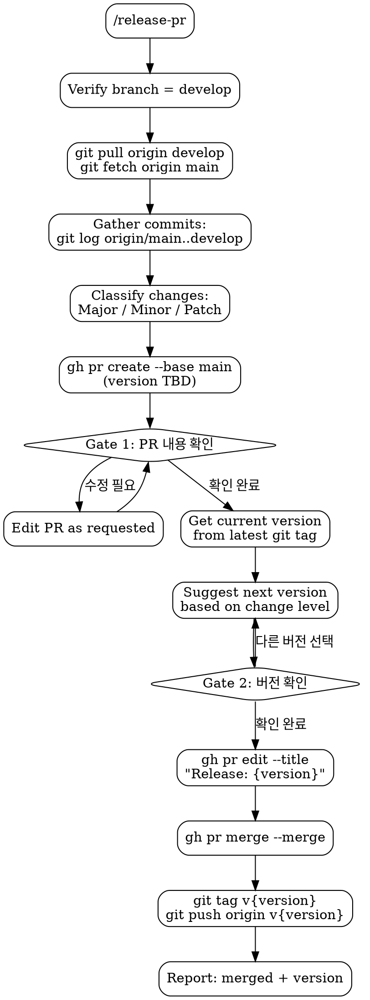

# Release PR

Standalone skill for creating release PRs from `develop` to `main`. Includes two confirmation gates and automatic version suggestion.

## Flowchart



## Process

1. **Verify branch**: must be on `develop`. If not, ask user to switch.
2. **Pull latest**: `git pull origin develop` and `git fetch origin main`
3. **Gather commits**: `git log origin/main..develop --format='%h %s (%an)'`
   - Classify each commit:
     - **Major**: breaking/incompatible API changes
     - **Minor**: `feat:` commits, new functionality
     - **Patch**: `fix:`, `test:`, `docs:`, `refactor:`, `chore:`
   - Resolve each author to their GitHub username (check commit history or `gh api`)

4. **Create PR**:

```bash
gh pr create --base main \
  --title "Release: (version TBD)" \
  --body "$(cat <<'EOF'
## Summary

### Major Changes
- {한글 설명} @{author-github-id}

### Minor Changes
- {한글 설명} @{author-github-id}

### Patch Changes
- {한글 설명} @{author-github-id}
EOF
)" \
  --assignee @me
```

   - Omit empty sections (no Major commits -> no Major heading)
   - Each item: `- {한글 설명} @{author-github-id}`

5. **Gate 1 — PR Confirmation**: Ask "PR 내용 확인해주세요. 문제 없나요?"
   - No -> edit PR content as requested, re-confirm
   - Yes -> proceed

6. **Gate 2 — Version Confirmation**:
   - Current version: `git describe --tags --abbrev=0` (default `0.0.0` if no tags exist)
   - Suggest next version based on highest change level:

| Highest Level | Bump | Example |
|---------------|------|---------|
| Major | major | 1.0.1 -> 2.0.0 |
| Minor | minor | 1.0.1 -> 1.1.0 |
| Patch | patch | 1.0.1 -> 1.0.2 |

   - Present as multiple choice for user to confirm or override
   - User picks different version -> use that

7. **Execute release**:
   - `gh pr edit {pr-number} --title "Release: {version}"`
   - `gh pr merge {pr-number} --merge`
   - `git tag v{version} && git push origin v{version}`
   - Report: done, merged, version, tag created

## Red Flags

- **Never** merge without both confirmations (PR content + version)
- **Never** skip version confirmation
- **Never** create release PR from any branch other than `develop`
